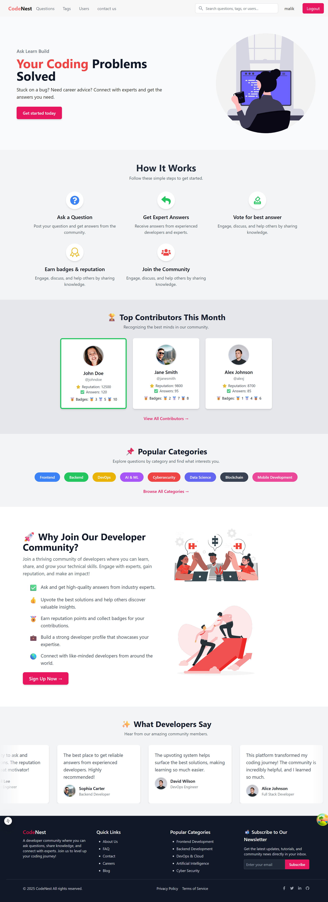

# CodeNest



CodeNest is a comprehensive platform designed to connect developers, facilitate knowledge sharing, and build a supportive coding community. This application enables users to ask programming questions, share code snippets, write technical blogs, and engage with content through voting, commenting, and more.

## 🌟 Features Overview

### 👥 User Authentication & Profile Management

- User registration and login functionality
- Secure authentication with JWT
- OAuth integration for social login
- Profile customization and management
- Role-based authorization (regular users, moderators, admins)

### ❓ Question & Answer Forum

- Ask technical questions with rich text formatting
- Add code examples with syntax highlighting
- Tag questions with relevant topics
- Upload multiple images for visual explanation
- Answer questions with formatting and code examples
- Vote on questions and answers
- Select and mark accepted answers
- Edit and update questions/answers

### 📝 Technical Blog Platform

- Create and publish technical blog posts
- Rich text editor with markdown support
- Code snippet integration with syntax highlighting
- Categorize blogs with tags
- Featured blogs showcase
- Blog post comments and engagement

### 💬 Community Engagement

- Comment on questions, answers, and blog posts
- Upvote and downvote content
- Report inappropriate content
- Contact administrators via contact form
- User reputation system based on contributions

### 🔍 Search & Discovery

- Search questions by keywords, tags, and content
- Filter questions by popularity, recency, and status
- Discover trending topics and questions
- Personalized recommendations

### 👑 Admin Dashboard

- Content moderation tools
- User management interface
- Site analytics and metrics
- Report handling system

## Getting Started

### Prerequisites

Make sure you have the following installed on your system:

- Node.js (v16+)
- MongoDB
- npm or yarn

### Installation

1. Clone the repository:

```bash
git clone https://github.com/MZeeshanMalik/CodeNest.git
```

2. Navigate to the project directory:

```bash
cd CodeNest
```

3. Install dependencies for both frontend and backend:

```bash
# For frontend
cd frontend
npm install

# For backend
cd ../backend
npm install
```

4. Set up environment variables:

```bash
# For backend (.env file in backend directory)
PORT=5000
MONGO_URI=your_mongodb_connection_string
JWT_SECRET=your_jwt_secret
CLIENT_URL=http://localhost:3000

# For frontend (.env.local file in frontend directory)
NEXT_PUBLIC_API_URL=http://localhost:5000
```

### Running the Development Server

#### Frontend

1. Navigate to the frontend directory:

```bash
cd frontend
```

2. Run the development server:

```bash
npm run dev
# or
yarn dev
# or
pnpm dev
# or
bun dev
```

3. Open [http://localhost:3000](http://localhost:3000) with your browser to see the result.

#### Backend

1. Navigate to the backend directory:

```bash
cd backend
```

2. Run the development server:

```bash
npm run dev
# or
yarn dev
```

3. The backend server will start on [http://localhost:5000](http://localhost:5000).

### Building for Production

#### Frontend

1. Navigate to the frontend directory:

```bash
cd frontend
```

2. Build the project:

```bash
npm run build
# or
yarn build
```

3. Start the production server:

```bash
npm start
# or
yarn start
```

#### Backend

1. Navigate to the backend directory:

```bash
cd backend
```

2. Start the production server:

```bash
npm start
# or
yarn start
```

## 🔧 Technical Implementation

### Backend Architecture

- **Express.js**: RESTful API framework
- **TypeScript**: Type-safe code
- **MongoDB**: NoSQL database with Mongoose ODM
- **Passport.js**: Authentication middleware
- **Multer**: File upload handling
- **JWT**: Token-based authentication

### Frontend Architecture

- **Next.js**: React framework with SSR/SSG
- **TypeScript**: Type-safe code
- **TailwindCSS**: Utility-first CSS
- **React Hook Form**: Form validation and handling
- **Tanstack Query**: Data fetching and caching
- **Rich Text Editor**: Enhanced content creation

## 🔍 API Documentation

The API is organized around RESTful principles. It accepts JSON request bodies, returns JSON responses, and uses standard HTTP response codes.

### Core Endpoints

#### Authentication

- `POST /api/v1/auth/register` - Register a new user
- `POST /api/v1/auth/login` - User login
- `GET /api/v1/auth/me` - Get current user

#### Questions

- `GET /api/v1/question` - Get all questions
- `POST /api/v1/question` - Create a new question
- `GET /api/v1/question/:id` - Get question by ID
- `PUT /api/v1/question/:id` - Update question
- `DELETE /api/v1/question/:id` - Delete question

#### Answers

- `GET /api/v1/answer/:questionId` - Get answers for a question
- `POST /api/v1/answer` - Post a new answer
- `PUT /api/v1/answer/:id` - Update an answer
- `DELETE /api/v1/answer/:id` - Delete an answer

#### Blogs

- `GET /api/v1/blog` - Get all blogs
- `POST /api/v1/blog` - Create a new blog
- `GET /api/v1/blog/:id` - Get blog by ID
- `PUT /api/v1/blog/:id` - Update blog
- `DELETE /api/v1/blog/:id` - Delete blog

## Learn More

To learn more about the technologies used in this project, take a look at the following resources:

- [Next.js Documentation](https://nextjs.org/docs) - learn about Next.js features and API.
- [Express.js Documentation](https://expressjs.com/) - learn about Express.js features and API.
- [MongoDB Documentation](https://docs.mongodb.com/) - learn about MongoDB.
- [Tailwind CSS Documentation](https://tailwindcss.com/docs) - learn about Tailwind CSS.

## 📂 Project Structure

### Backend Structure

```
backend/
├── src/
│   ├── app.ts                # Express app configuration
│   ├── server.ts             # Server entry point
│   ├── config/               # Configuration files
│   ├── controllers/          # API route controllers
│   ├── middlewares/          # Custom middlewares
│   ├── models/               # MongoDB models
│   ├── router/               # API route definitions
│   ├── utils/                # Utility functions
│   └── uploads/              # User uploaded content
├── package.json
└── tsconfig.json
```

### Frontend Structure

```
frontend/
├── src/
│   ├── app/                  # Next.js 13+ app directory
│   │   ├── layout.tsx        # Root layout
│   │   ├── page.tsx          # Homepage
│   │   ├── (auth)/           # Authentication pages
│   │   ├── questions/        # Question related pages
│   │   ├── (blog)/           # Blog related pages
│   │   └── (dashboard)/      # User dashboard pages
│   ├── components/           # UI components
│   ├── hooks/                # Custom React hooks
│   ├── lib/                  # Utility functions and API calls
│   ├── services/             # Service integrations
│   ├── types/                # TypeScript types
│   └── utils/                # Utility functions
├── public/                   # Static assets
└── package.json
```

## 📱 Screenshots

### Homepage


_The CodeNest homepage showcases trending questions, featured blogs, and provides navigation to all platform features._

### Question Detail


_Detailed view of a question with answers, code snippets, and interactive elements like voting and commenting._

### Rich Text Editor


_The custom rich text editor enables users to format text, add code snippets, and upload images._

### User Profile


_User profiles showcase contributions, badges, and reputation scores._

## 🔒 Security Best Practices

CodeNest implements the following security measures:

- **Authentication**: JWT tokens with proper expiration and refresh mechanism
- **Authorization**: Role-based access control (RBAC) for protected resources
- **Data Validation**: Input validation on both client and server
- **CSRF Protection**: Anti-CSRF tokens to prevent cross-site request forgery
- **XSS Prevention**: Content sanitization and proper escaping
- **Rate Limiting**: Prevents brute force and DDoS attacks
- **Secure Headers**: Helmet.js for secure HTTP headers
- **Sensitive Data**: Environment variables for secrets, password hashing with bcrypt
- **Dependency Scanning**: Regular vulnerability checks for npm packages

## 📊 Monitoring & Logging

- **Error Tracking**: Integration with Sentry.io
- **Performance Monitoring**: Server-side metrics collection
- **Log Management**: Structured logging with timestamps and log levels
- **API Metrics**: Response times, error rates, and throughput monitoring
- **User Analytics**: Anonymous usage data collection for feature improvements

## 🛣️ Roadmap

- Real-time notifications system
- User messaging capabilities
- Community groups/forums
- Code playground integration
- Enhanced search with AI recommendations
- Mobile application development
- International language support
- Advanced admin dashboard
- User reputation system enhancements
- Integration with GitHub/GitLab accounts

## 💻 Development Practices

### Code Style & Quality

This project follows strict coding standards to ensure maintainability and quality:

- ESLint and Prettier for code formatting
- TypeScript for type safety
- Jest for unit testing
- Cypress for end-to-end testing
- Husky for pre-commit hooks
- GitHub Actions for CI/CD

### Branching Strategy

We follow the Gitflow workflow:

- `main`: Production-ready code
- `develop`: Integration branch for features
- `feature/*`: New features and enhancements
- `bugfix/*`: Bug fixes
- `release/*`: Release preparation
- `hotfix/*`: Urgent production fixes

### Version Control

- Semantic versioning (MAJOR.MINOR.PATCH)
- Meaningful commit messages following conventional commits format
- Pull requests require code review before merging

## Contributing

We welcome contributions from the community! If you would like to contribute, please follow these steps:

1. Fork the repository.
2. Create a new branch (`git checkout -b feature/your-feature`).
3. Make your changes.
4. Run the tests to ensure nothing is broken.
5. Commit your changes following the conventional commits format (`git commit -m 'feat: Add some feature'`).
6. Push to the branch (`git push origin feature/your-feature`).
7. Open a pull request with a detailed description of changes.

### Development Process

1. Select an issue to work on (or create one)
2. Discuss the implementation approach in the issue
3. Develop and test your solution
4. Submit a pull request
5. Address review comments
6. Once approved, your changes will be merged

## ❓ Frequently Asked Questions

### How is CodeNest different from Stack Overflow?

While inspired by platforms like Stack Overflow, CodeNest focuses on creating a more comprehensive developer experience with integrated blogging, community features, and a modern UI/UX designed for today's developers.

### Can I use CodeNest for my private team?

Yes, in the future we plan to offer team/enterprise versions with private instances, SSO integration, and custom branding.

### Is mobile support available?

The platform is fully responsive and works on mobile browsers. A dedicated mobile app is on our roadmap for future development.

### How is content moderation handled?

Content moderation uses a combination of:

- Community-based reporting system
- Automated content scanning for obvious violations
- Trusted moderator reviews
- Admin dashboard tools for content management

### What about API access?

We plan to provide public API access in the future for integrations and extensions.

## License

This project is licensed under the ISC License - see the [LICENSE](LICENSE) file for details.

## Contact

For any questions or feedback, please use the contact form on our platform or open an issue on the [GitHub repository](https://github.com/MZeeshanMalik/CodeNest/issues).

---

© 2025 CodeNest Team. All rights reserved.
